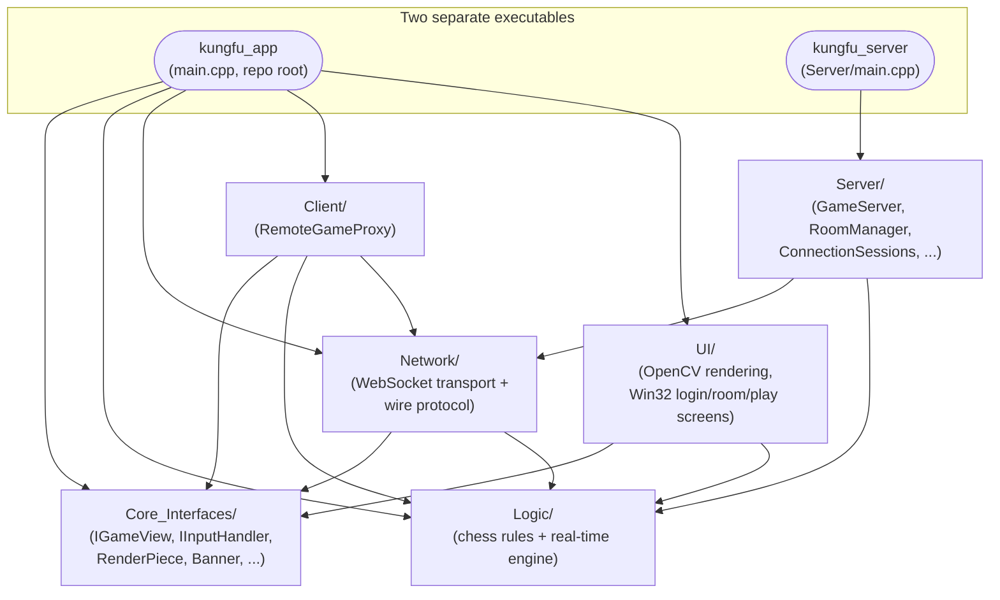
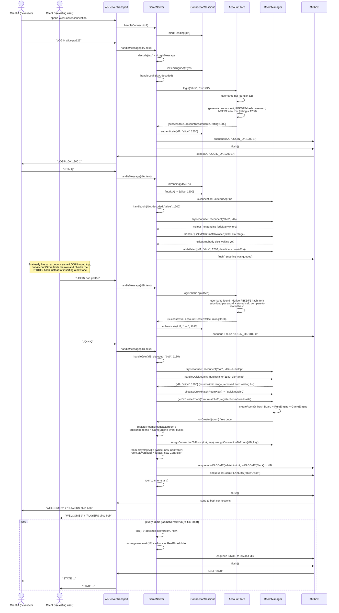
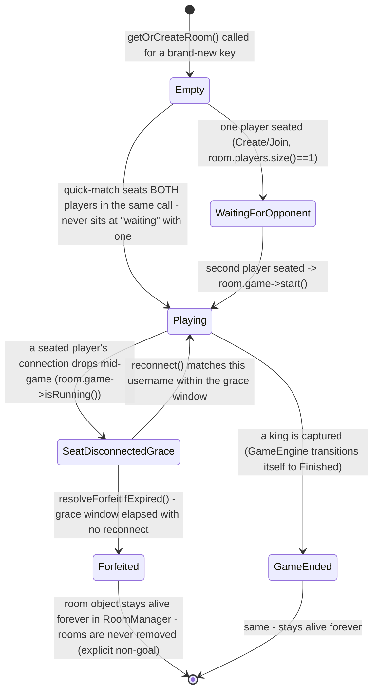
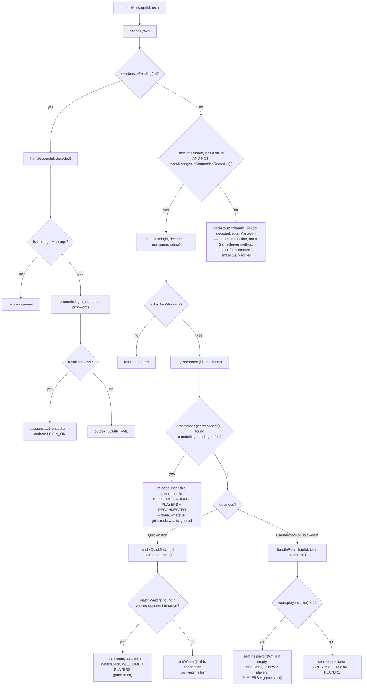

# Kung Fu Chess — Architecture Diagrams

A companion to `docs/PROJECT_GUIDE.md`: that document is reference-first (read a section to
look something up); this one is visual-first (look at a diagram, then read the walkthrough
underneath it to actually follow the logic). Every diagram here was drawn by reading the
current source directly — method names, call order, and branch conditions are all
cross-checked against the real code, not reconstructed from memory.

**Status**: Part 1 (the big picture) and Part 2 (four server-flow diagrams) are below.
Part 3 (every class/function under `Server/`, `Network/`, `Client/`, in depth) follows once
you've confirmed these read correctly — no point writing a long prose section under a diagram
that needs fixing first.

---

## Part 1 — The big picture



**Reading the arrows**: an arrow from A to B means "A `#include`s B's headers" (verified
against the actual `#include` lines in every file, not assumed from folder names). Two nodes
with no arrow between them genuinely never reference each other's types.

### What each module owns, and why the arrows point this way

- **`Logic/`** is the actual chess-with-real-time engine (`GameEngine`, `RuleEngine`,
  `RealTimeArbiter`, `Controller`, `Board`, the piece rule classes). It depends on **nothing**
  outside itself except two `.cpp` files pulling in `Core_Interfaces/IGameView.hpp` purely to
  get the concrete `RenderPiece` struct definition for `getRenderState()`. It has zero
  awareness that OpenCV, Win32, WebSockets, or a network exists. This is deliberate: it's
  what lets `Logic/` be unit-tested completely on its own (`kungfu_tests`), and it's what
  makes both a local single-process game *and* a networked one possible from the same
  engine — `Server/` runs a real `GameEngine` per match; nothing in `Logic/` had to change to
  make that work.
- **`Core_Interfaces/`** is two abstract types (`IGameView`, `IInputHandler`) plus a handful
  of plain-data structs (`RenderPiece`, `BoardHighlight`, `Scoreboard`, `Banner`). It's the
  seam that lets a renderer be swapped without touching `Logic/`: neither side ever hands the
  other a real `Piece*` or `cv::Mat`, only plain data.
- **`UI/`** is the OpenCV renderer (`OpenCvView`, `BoardRenderer`, `ScoreboardRenderer`,
  `AssetManager`) plus the Win32 login/room/play screens. It depends on `Logic/` only for a
  few enums (`PieceType`/`PlayerColor` for choosing sprites, `GameConfig::kBoardSize` for
  layout) — never on `GameEngine`, `Controller`, or any live game object. It has **zero**
  dependency on `Network/` or `Client/`: `UI/Windows/`'s three pre-game screens
  (`LoginScreen`, `RoomChoiceScreen`, `PlayConfirmScreen`) return plain data (a username/
  password pair, a `RoomChoice`) and the composition root (`main.cpp`) is the only place that
  turns that into an actual network call.
- **`Network/`** is the wire format (`Protocol.hpp`/`.cpp`) and the two WebSocket transport
  wrappers (`WsServerTransport`, `WsClientTransport`). It depends on `Logic/` because the
  protocol deliberately *reuses* `Logic`'s own event structs (`MoveStarted`, `PieceCaptured`,
  `GameStarted`, `GameEnded`) and a few model types (`PlayerColor`, `PieceType`, `Position`)
  directly as wire-message payloads, rather than maintaining a parallel "network event"
  hierarchy that could drift out of sync with the real one.
- **`Client/`** (just `RemoteGameProxy`) is a client-side stand-in for a local `GameEngine` —
  it depends on `Network/` (to actually talk to the server) and `Logic/` (to expose the same
  event-bus shape a real `GameEngine` would). It has **zero** dependency on `UI/`: nothing
  about `RemoteGameProxy` assumes OpenCV or Win32 exists, which is what makes it plausible
  that a completely different renderer could reuse it unchanged.
- **`Server/`** depends on `Logic/` directly (it owns one real `Board`/`RuleEngine`/
  `GameEngine`/`Controller` per room — see `Server/Room.hpp`) and on `Network/` (to talk to
  clients). It has **zero** dependency on `Core_Interfaces/` or `UI/` — the server never
  renders anything, so it has no use for `RenderPiece`/`IGameView` at all; it only ever
  produces the *text* form of game state (`STATE ...`) via `Network/Protocol.cpp`'s
  `encodeState`.
- The two **executables** are where everything converges: `main.cpp` (client) is the only
  file that knows about `UI/`, `Client/`, `Network/`, and `Logic/` all at once (see
  `PROJECT_GUIDE.md` §4.17); `Server/main.cpp` is deliberately much thinner — it only
  constructs objects and calls `GameServer::run()` (diagram 4 below shows why: everything
  that would otherwise clutter `main()` is `GameServer`'s own internal call structure).

The one rule that makes all of this hold together: **`Logic/` never depends on anything
above it.** Every other module can change independently (swap the renderer, add a new wire
message, rewrite the server's connection handling) without `Logic/` ever needing to know.

---

## Part 2 — Server-side flow, in detail

### 1. New player connects, logs in, quick-matches, game starts



**Why LOGIN and JOIN are two separate messages, not one.** Authentication ("who are you") and
routing ("what match do you want") are genuinely independent decisions, and the client's own
UI mirrors that split: `LoginScreen` resolves first, then `RoomChoiceScreen`/
`PlayConfirmScreen` decide the room — a player might retry `LoginScreen` after a wrong
password without ever having chosen a room yet. Keeping them as two messages is what lets
`ConnectionSessions` (identity only) and `RoomManager` (rooms/matchmaking only) stay
completely independent of each other — `ConnectionSessions` never needs to know a room exists,
and `RoomManager` never needs to know how a username was authenticated.

**Why `tryReconnect` runs before quick-match/room-join even on this first-ever JOIN.** It costs
nothing when there's genuinely nothing to reconnect to (`RoomManager::reconnect` just scans
every room for a matching pending forfeit and returns immediately if none exists), and it means
`GameServer` never has to ask "is this actually a reconnection?" — the reconnecting player's
client goes through the exact same LOGIN → JOIN path as a brand-new player, clicking whatever
they want on `RoomChoiceScreen`; the server alone decides whether that's actually a resume.

**Why the tick loop runs even before two players exist.** `GameEngine::wait(ms)` is a no-op
until `start()` has been called, so ticking a room that's still waiting for a second player
costs nothing — there's no special "is this room ready to tick" check needed anywhere.

**Why `Outbox` exists at all, instead of just calling `WsServerTransport::send` directly.**
`ix::WebSocket::send()` can, if it detects a dead connection, synchronously invoke that same
transport's Close callback on the calling thread before `send()` returns — and that Close
callback is `GameServer::handleDisconnect`, which tries to lock `gameMutex`. If `send()` were
called while `gameMutex` was already held (which every branch above is), that's a
self-deadlock. `Outbox` splits every send into "queue while locked" then "flush after
unlocking," making that interleaving impossible by construction.

**Why `gameMutex` is needed in the first place.** `WsServerTransport` fires `onConnect`/
`onMessage`/`onDisconnect` on IXWebSocket's own background I/O thread(s) (see its own
`clients_`/`clientsMutex_`, which is a *separate* mutex protecting only its connection-id → 
`ix::WebSocket*` map). `GameEngine`/`Controller`, on the other hand, were built assuming
single-threaded access. `gameMutex` is the one lock that makes it safe for two connections'
messages (or a message and a disconnect) to arrive concurrently on different IXWebSocket
threads and still touch `RoomManager`/`ConnectionSessions`/the domain state safely.

---

### 2. Disconnect mid-game → forfeit countdown → reconnect *or* forfeit resolves

```mermaid
sequenceDiagram
    actor A as Client A (White, alice)
    participant WST as WsServerTransport
    participant GS as GameServer
    participant RM as RoomManager
    participant OB as Outbox
    actor B as Client B (Black, bob)

    Note over A,B: A game is already Running - alice = White, bob = Black

    A--xWST: connection drops (network loss, app closed, ...)
    WST->>GS: handleDisconnect(idA)
    GS->>RM: removeWaiter(idA) (no-op - not in the quick-match queue)
    GS->>RM: roomForConnection(idA) -> the room
    GS->>GS: room.players.find(idA) found, room.game->isRunning() true
    GS->>RM: startForfeitCountdown(room, White, 20000ms)
    RM->>RM: room.pendingForfeit = {White, now + 20s}
    GS->>OB: enqueueToRoom FORFEIT_WARNING(White, 20000)
    GS->>RM: forgetConnectionRoom(idA)
    GS->>GS: sessions.forget(idA)
    GS->>OB: flush()
    OB->>WST: send to bob's connection
    WST->>B: "FORFEIT_WARNING w 20000"
    Note over B: client shows "Opponent disconnected - auto-win in 20s"<br/>and counts down locally (RemoteGameProxy's own clock estimate)

    alt (a) alice reconnects within the 20s window
        A->>WST: opens a NEW WebSocket connection (idA2)
        WST->>GS: handleConnect(idA2) -> sessions.markPending(idA2)
        A->>WST: "LOGIN alice pw123" (same credentials)
        WST->>GS: handleMessage -> handleLogin -> AccountStore confirms password
        GS->>GS: sessions.authenticate(idA2, "alice", rating); LOGIN_OK
        A->>WST: "JOIN Q" (or Create/Join - doesn't matter which)
        WST->>GS: handleMessage(idA2, text) -> handleJoin(idA2, decoded, "alice", rating)
        GS->>RM: tryReconnect: reconnect("alice", idA2)
        RM->>RM: scan rooms for pendingForfeit whose<br/>disconnected seat's username == "alice" - found
        RM->>RM: move PlayerSession from old key to idA2,<br/>controller->attachGame(...) clears stale selection,<br/>pendingForfeit.reset()
        RM-->>GS: {room, White}
        GS->>RM: assignConnectionToRoom(idA2, room.key)
        GS->>OB: enqueue WELCOME(White), ROOM(key), PLAYERS(...) to idA2
        GS->>OB: enqueueToRoom RECONNECTED(White)
        GS->>OB: flush()
        OB->>WST: send to both
        WST->>A: "WELCOME w" / "ROOM ..." / "PLAYERS ..."
        WST->>B: "RECONNECTED w"
        Note over B: client shows "Opponent reconnected!" and the<br/>countdown display disappears
        Note over A,B: tick loop continues normally - pendingForfeit is<br/>gone, resolveForfeitIfExpired() is a no-op for this room
    else (b) nobody reconnects before the deadline
        loop every 16ms, for ~20 seconds
            GS->>GS: tick() -> advanceRoom(room, now)
            GS->>RM: resolveForfeitIfExpired(room, now)
            RM->>RM: now < pendingForfeit.deadline - not yet, returns nullopt
        end
        GS->>GS: tick() -> advanceRoom(room, now) - the tick where now >= deadline
        GS->>RM: resolveForfeitIfExpired(room, now)
        RM->>RM: winner = Black (the color that DIDN'T disconnect)
        RM->>RM: move remaining players to spectators,<br/>players.clear(), game->stop(), pendingForfeit.reset()
        RM-->>GS: {winner: Black}
        GS->>OB: enqueueToRoom FORFEIT(Black)
        GS->>GS: applyMatchResult(room, Black, accounts, outbox, logger)
        GS->>OB: enqueueToRoom RATINGS(newWhiteRating, newBlackRating)
        GS->>OB: flush()
        OB->>WST: send to bob (now a spectator of his own former match)
        WST->>B: "FORFEIT b" / "RATINGS ..."
    end
```

**Why the disconnected player's seat isn't dropped immediately.** Their username is still
needed for the eventual Elo update — `applyMatchResult` reads `room.players` to find both
usernames, so the seat has to survive until the forfeit (or reconnection) actually resolves,
not just until the socket closes.

**Why reconnection is matched by *username*, not a session token or the room id.** Phase 4
already added password-authenticated accounts, so a successful `LOGIN` is already stronger
proof of identity than any client-held token could be (a token can be lost or spoofed; a
password can't be guessed in one try). It also sidesteps a real problem: quick-match rooms
never expose a room id to the client at all (there's nothing user-facing to type back in), so
matching by room id wouldn't even be possible for a quick-matched player who disconnects.

**Why `resolveForfeitIfExpired` is checked once per room, per tick, inline — not batched.**
`room.game->stop()` (part of resolving the forfeit) has to run *before* that same room's
`game->wait(kTickMs)` call in the *same* tick, or `GameEngine` would simulate one extra 16ms
tick of movement after the deadline had already technically passed. Batching this into a
separate up-front pass (the way quick-match's `reapExpiredWaiters` works) would still happen
to be safe here too (different rooms never interact), but keeping it inline, at the exact spot
the original code had it, makes the ordering *provably* unchanged rather than "equivalent by
argument" — this was a deliberate, carefully-checked decision (see the session history behind
this refactor).

---

### 3. A room's lifecycle, as a state diagram

Your proposed framing (`waiting → matched → playing → disconnected/grace-period →
reconnected-or-forfeited → game ended`) is close, but the real code draws a few lines in
different places than that suggests — corrected below, with the two most important
corrections called out right after the diagram.



**Correction 1 — a "forfeited" game and a "king captured" game are NOT the same underlying
state.** A real king capture sets `GameEngine`'s internal state to `Finished`
(`GameEngine::isFinished()` becomes true). A resolved forfeit calls `room.game->stop()`, which
sets `GameEngine`'s internal state to **`Paused`**, not `Finished`. Both make
`GameEngine::isRunning()` false (so the tick loop's `game->wait()` becomes a no-op either way,
which is why nothing outwardly *looks* different), but if you ever go looking for
`isFinished()` after a forfeit, it will say `false` — a genuinely easy trap if you assume "the
match is over" is one single state everywhere in the code.

**Correction 2 — "matched" isn't always a separate state from "waiting."** Your framing
implies every room passes through a `waiting` state before becoming `playing`. That's true for
`CreateRoom`/`JoinRoom` (one player sits in `WaitingForOpponent` until a second joins), but
**not** for quick-match: `RoomManager::matchWaiter` only ever creates a room at the exact
moment a second waiting player is found, so a quick-matched room is born already in `Playing`
— it never has a "waiting" phase of its own (the *player* waits, in `RoomManager`'s
`quickMatchWaiting_` list, before any room exists at all).

**One more thing this diagram deliberately leaves out**: a **spectator** (the 3rd+ connection
to `JOIN` an already-full room) isn't a room state at all — it's a per-connection role that
can start the instant `Playing` begins and lasts until that connection disconnects, completely
orthogonal to whether the room itself is `Playing`, `SeatDisconnectedGrace`, `Forfeited`, or
`GameEnded`. Spectators keep receiving `STATE` broadcasts throughout, including after a
forfeit resolves (the forfeited seats' former players are moved into the spectator set too, so
they can keep watching).

---

### 4. `GameServer`'s internal call structure



**Why this is broken into ten small methods instead of one long `onMessage` handler.** Every
branch point above corresponds to a genuinely different question ("who is this," "what do they
want," "which of three ways do they want it") — collapsing them back into one function would
just mean re-introducing the exact wall of nested `if`s this shape was extracted specifically
to get away from. Each named method reads as an answer to one question, and none of them need
to know how the others reached their own decision.

**Why `tryReconnect`/`handleQuickMatch`/`handleRoomJoin` are mutually exclusive, checked in
that exact order.** Reconnection is checked first specifically so it wins over whatever the
client actually clicked (see the "why matched by username" note above) — a reconnecting
player's client has no special "resume" button, it just goes through the ordinary
`RoomChoiceScreen` flow again. Quick-match and Create/Join are mutually exclusive by
construction (`join.mode` is one enum value), so there's no real ordering question between
those two — only reconnection needs to jump the queue.

**Why `ClickRouter::handleClick` isn't a `GameServer` method at all**, even though it's called
from the same `handleMessage` dispatch as everything else. It doesn't need `GameServer`'s own
state (`accounts_`/`sessions_`/`server_`/etc.) — only `RoomManager`, which it already receives
as a parameter. Keeping it a free function in `Server/ClickRouter.cpp` (domain layer, §5.7 of
`PROJECT_GUIDE.md`) rather than a `GameServer` method is exactly the Ports & Adapters line this
whole class exists to draw: `GameServer` decides *which* domain call to make; the domain
classes themselves decide what happens once called.

---

Let me know if any of these four diagrams (or Part 1's big picture) don't match your mental
model before I write Part 3 — the full class-by-class breakdown of `Server/`, `Network/`, and
`Client/`.
